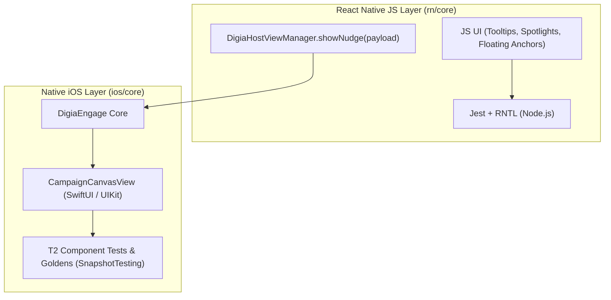

# Digia Engage iOS Test Suite (`DigiaEngageTests`)

This directory contains the automated test suites for the Digia Engage iOS SDK (`ios/core`), covering **Tier 1 (Unit & Domain)** and **Tier 2 (Component, Wire Contracts & Visual Goldens)** in accordance with the [Production Testing Master Execution Plan](../../../ai_docs/production-testing-execution-plan.md).

---

## 1. Do Component Tests Need a Simulator?

**Yes.** Native iOS component and visual golden tests require an iOS Simulator runtime.

### Why:
- **UIKit & SwiftUI Engine**: `CampaignCanvasView`, `NudgeOverlayView`, and `UIHostingController` rely on iOS-specific layout passes, UIKit window hierarchies, and CoreText typography rendering that exist only in `iPhoneSimulator.platform` (not the host macOS runtime).
- **Pixel-Accurate Rendering**: Point-Free `SnapshotTesting` captures pixel buffers at retina scale (`@3x` on Pro Max, `@2x` on standard models). Font rasterization and colors must execute against the pinned iOS Simulator profile to match reference goldens deterministically.
- **Headless Execution**: While a simulator runtime is required, **no interactive simulator window needs to be open**. `xcodebuild test` runs headlessly in background/CI environments.

---

## 2. Pinned Reference Simulator Specification (Match Before Testing)

Visual golden diffing (`.image`) requires a deterministic pixel grid, scale factor, and typography rasterizer. All golden snapshots in this repository are recorded against the pinned reference simulator profile below.

> [!IMPORTANT]
> **Check your simulator environment before running visual tests.** If your booted simulator does not match this configuration, visual golden diffs will fail due to scale or dimension mismatches.

### Reference Hardware & Environment Configuration

| Parameter | Pinned Value | Details / Verification |
| :--- | :--- | :--- |
| **Device Model** | `iPhone 17 Pro Max` | Pinned flagship form factor |
| **OS Version** | `iOS 26.0` (or `iOS 26.x`) | Target simulator runtime |
| **Display Scale** | `@3x` (3.0 scale) | 3 physical pixels per point |
| **Physical Resolution** | `1320 x 2868` px | 460 ppi density |
| **Logical Dimensions** | `440 x 956` pt | Fixed viewport bounds |
| **UI Appearance** | `Light` | Standard light theme (no dark mode overrides) |
| **Dynamic Type Size** | `large` | Standard iOS default font scale |
| **Safe Area Insets** | Top: 59 pt, Bottom: 34 pt | Dynamic Island & Home Indicator |

---

### Verifying and Matching Your Simulator

#### 1. Check your booted simulator:
```bash
xcrun simctl list devices booted
```
Verify that `iPhone 17 Pro Max` is listed as `(Booted)`.

#### 2. Boot or switch to the pinned device:
```bash
# Boot the pinned simulator
xcrun simctl boot "iPhone 17 Pro Max"

# Set UI appearance to Light mode
xcrun simctl ui "iPhone 17 Pro Max" appearance light

# Set Dynamic Type to standard default
xcrun simctl ui "iPhone 17 Pro Max" content_size large
```

#### 3. Automatic Device Enforcement:
The [`./run-tests.sh`](../run-tests.sh) convenience runner automatically detects any booted `iPhone 17 Pro Max`. If none is booted, it instructs `xcodebuild` to target the pinned `iPhone 17 Pro Max` profile directly.

---

## 3. How React Native iOS (RN-iOS) Relates to These Tests

React Native does not implement a separate canvas rendering engine in JavaScript. Rendering is divided into two distinct layers:



1. **JS-Owned Components (Tooltips, Spotlights, Anchors)**:
   - Tested in `rn/core/tests/` using **Jest + React Native Testing Library (RNTL)**.
   - Runs in pure **Node.js** in milliseconds without requiring Xcode or a simulator.
2. **Native Canvas Campaigns (Nudges, BottomSheets, Fullscreen, Surveys)**:
   - Serialized in JS and passed across the bridge to `DigiaHostViewManager.swift` (`DigiaEngageReactNative` pod).
   - The native view that mounts and displays on the user's screen *is* `ios/core`'s `CampaignCanvasView`.
   - **Visual golden tests in `ios/core/Tests/DigiaEngageTests/Components/` directly test the exact UI rendered in RN-iOS apps.**
3. **End-to-End Bridge Integration (T3)**:
   - 12 shared Maestro journeys run against `medihub_rn` (or `medihub_ios`) to verify the real touch dispatch, bridge event serialization, and app lifecycle together.

---

## 4. Directory Layout

```text
DigiaEngageTests/
├── Components/                             <-- [Tier 2] Visual Goldens & Hierarchy
│   ├── Common/
│   │   ├── SnapshotTestingExtensions.swift <-- .sanitizedHierarchy strategy & env flags
│   │   └── FixtureLoader.swift             <-- Loads testkit/campaigns/... fixtures
│   │
│   ├── Nudge/
│   │   ├── NudgeDialogComponentTests.swift
│   │   ├── NudgeBottomSheetComponentTests.swift
│   │   └── __Snapshots__/                  <-- Co-located golden baselines
│   │       ├── NudgeDialogComponentTests/
│   │       │   ├── testNudgeDialogComponentHierarchyAndLayout.1.txt
│   │       │   └── testNudgeDialogVisualImageGolden.1.png
│   │       └── NudgeBottomSheetComponentTests/
│   │           ├── testNudgeBottomSheetComponentHierarchyAndLayout.1.txt
│   │           └── testNudgeBottomSheetVisualImageGolden.1.png
│   │
│   ├── Survey/                             <-- Canvas survey component tests
│   ├── Guide/                              <-- Tooltip & spotlight native hosts
│   ├── Floater/                            <-- Floating widgets & PIP
│   └── Inline/                             <-- Banners, stories, carousels
│
├── SessionIdentity/                        <-- [Tier 1 & 2] Session lifecycle, user ID rotation
├── Network/                                <-- [Tier 1 & 2] NetworkClient, retries, mock transports
├── Routing/                                <-- [Tier 1] Surface priority, rules, suppression
├── Analytics/                              <-- [Tier 1] Events, telemetry, health sinks
├── Lifecycle/                              <-- [Tier 2] SDK bootstrapping & startup reliability
├── Contracts/                              <-- [Tier 2] Campaign wire format verification
└── Unit/                                   <-- [Tier 1] ColorHex, Interpolate, typography utils
```

---

## 5. Running Tests by Tag

Every Swift Testing suite carries tags (declared in [`TestingTags.swift`](TestingTags.swift)): one **kind** (`unit`, `contract`, `component`, `golden`, `integration`), optional **gate** tags (`smoke`, `slow`), and one or more **areas** (`nudge`, `session`, `analytics`, ...). `xcodebuild` selects by tag natively, so no `.xctestplan` is needed.

### Using the Convenience Wrapper (`./run-tests.sh`)
The wrapper pins the iPhone 17 Pro Max simulator, validates the tag against `TestingTags.swift`, and fails if a filter matched no tests (xcodebuild alone reports success on zero tests):
```bash
./run-tests.sh nudge      # one tag
./run-tests.sh smoke      # default
./run-tests.sh quick      # everything except `slow`
./run-tests.sh all        # everything
```

### Native Xcode commands
```bash
xcodebuild test -scheme DigiaEngage -destination "platform=iOS Simulator,name=iPhone 17 Pro Max" -only-testing-tags nudge
xcodebuild test -scheme DigiaEngage -destination "platform=iOS Simulator,name=iPhone 17 Pro Max" -skip-testing-tags slow
# One suite, without tags:
xcodebuild test -scheme DigiaEngage -destination "platform=iOS Simulator,name=iPhone 17 Pro Max" -only-testing:DigiaEngageTests/NudgeDialogComponentTests
```
`XCTestCase` classes cannot carry tags; they run only under `all`/`quick` or `-only-testing:`.

---

## 6. Updating Golden Snapshots

When visual designs intentionally change, update the golden baselines using the `RECORD_SNAPSHOTS` environment variable:

```bash
# 1. Re-record goldens for a tag (the run always fails in record mode, by design):
./run-tests.sh nudge record        # or: RECORD_SNAPSHOTS=true ./run-tests.sh nudge

# 2. Verify git diff:
git diff Tests/DigiaEngageTests/Components/

# 3. Perform a fresh verification run (must pass without record mode):
./run-tests.sh nudge
```

---

## 7. Inspecting Visual Regressions (When Snapshots Fail)

When a visual golden fails, `SnapshotTesting` does not alter scripts or project files. Instead, it prints the exact file URLs of the reference baseline and the rendered failure to the console:

```text
error: testNudgeBottomSheetVisualImageGolden() : failed - Snapshot does not match reference.

@− (Baseline):
"file:///Users/ram/.../__Snapshots__/NudgeBottomSheetComponentTests/testNudgeBottomSheetVisualImageGolden.1.png"

@+ (Failure):
"file:///Users/ram/Library/.../CoreSimulator/Devices/.../testNudgeBottomSheetVisualImageGolden.1.png"

The percentage of pixels that match 0.14013672 is less than required 0.99
The lowest perceptual color precision 0.0 is less than required 0.98
```

### Viewing the Visual Difference:

1. **Open both URLs in macOS Preview / Quick Look**:
   Copy and run the two paths directly in Terminal:
   ```bash
   open "<path_from_@−>" "<path_from_@+>"
   ```

2. **Open with Diff Tools (e.g. Kaleidoscope)**:
   If you have Kaleidoscope or ImageMagick installed, diff them side-by-side:
   ```bash
   ksdiff "<path_from_@−>" "<path_from_@+>"
   ```

3. **Open Xcode Test Results (`.xcresult`)**:
   Open the Xcode test result bundle printed at the end of the run to review failure logs and diagnostics inside Xcode:
   ```bash
   open <path_to_Test-...xcresult>
   ```


### Snapshot Determinism Rules:
- **Sanitized Hierarchy (`.sanitizedHierarchy`)**: Strips memory pointers (`: 0x...`) and private compiler mangled symbols (`$HASH`) from `recursiveDescription` so text snapshots do not flake across runs or build flags.
- **Image Precision**: Golden pixel comparisons use `precision: 0.99` and `perceptualPrecision: 0.98` to tolerate micro subpixel anti-aliasing differences across minor OS simulator revisions.
